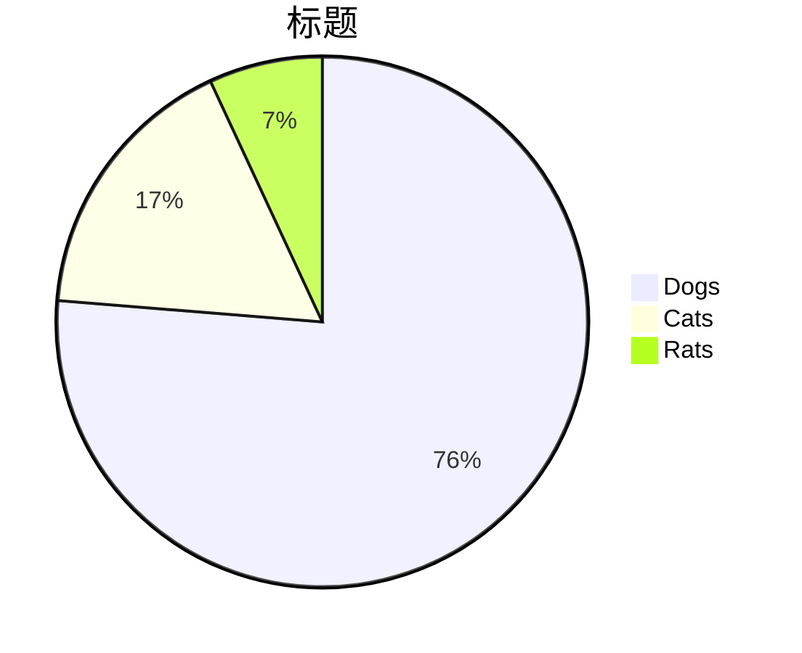
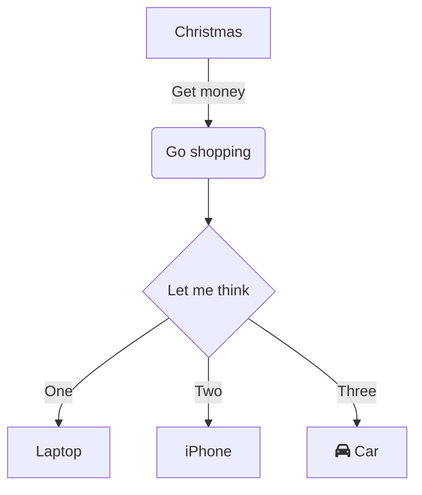
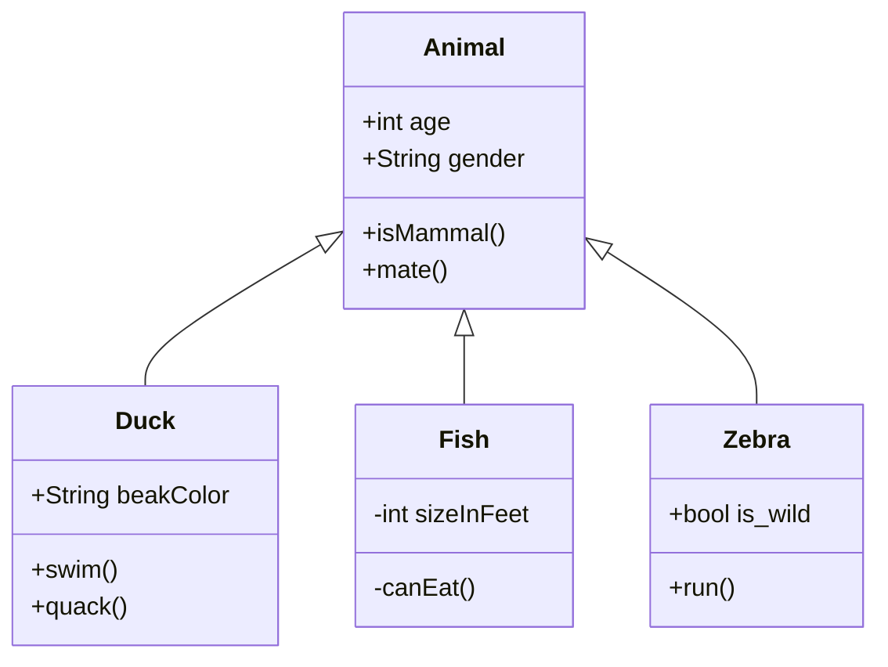
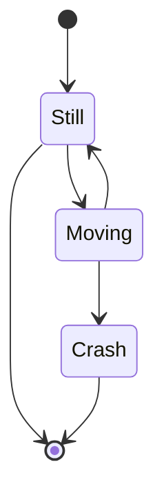
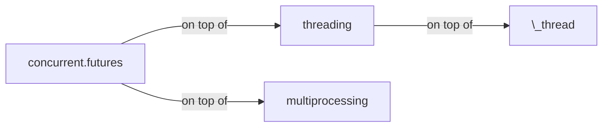

## quick markdown

文章命名： `YYYY-MM-DD-name-of-post.ext` 和其他必要选项

 *斜体*, **粗体**,  `代码`. 

列表:

  * this one
  * that one
  * the other one

  1. first item
  2. second item
  3. third item

Note that --- not considering the asterisk --- the actual text
content starts at 4-columns in.

> 引用 
>
> > 里的引用

用3个破折号表示一个破折号---

用两个破折号表示范围12--14

三个点会被转换为省略号...

支持unicode☺

    # Let me re-iterate ...
    for i in 1 .. 10 { do-something(i) }

超链接

Here's a link to [a website](http://foo.bar), to a [local
doc](local-doc.html), and to a [section heading in the current
doc](#an-h2-header). Here's a 注脚 [^test].
A named link to [MarkItDown][3]. The easiest way to do these is to select what you want to make a link and hit `Ctrl+L`.
Another named link to [MarkItDown](https://www.markitdown.net/)
Sometimes you just want a URL like <https://www.markitdown.net/>.

[^test]: Some footnote text.


分割线

***

Here's a definition list:

apples
  : Good for making applesauce.

oranges
  : Citrus!

tomatoes
  : There's no "e" in tomatoe.

Again, text is indented 4 spaces. (Put a blank line between each
term and  its definition to spread things out more.)

Here's a "line block" (note how whitespace is honored):

| Line one
|   Line too
| Line tree

and images can be specified like so:


Inline math equation: $\omega = d\phi / dt$. Display
math should get its own line like so:

$$I = \int \rho R^{2} dV$$


| Title 1               | Title 2               | Title 3               | Title 4               |
| --------------------- | --------------------- | --------------------- | --------------------- |
| lorem                 | lorem ipsum           | lorem ipsum dolor     | lorem ipsum dolor sit |
| lorem ipsum dolor sit | lorem ipsum dolor sit | lorem ipsum dolor sit | lorem ipsum dolor sit |
| lorem ipsum dolor sit | lorem ipsum dolor sit | lorem ipsum dolor sit | lorem ipsum dolor sit |
| lorem ipsum dolor sit | lorem ipsum dolor sit | lorem ipsum dolor sit | lorem ipsum dolor sit |


## post comment

Eos eu docendi tractatos sapientem, brute option menandri in vix, quando vivendo accommodare te ius. Nec melius fastidii constituam id, viderer theophrastus ad sit, hinc semper periculis cum id. Noluisse postulant assentior est in, no choro sadipscing repudiandae vix. Vis in euismod delenit dignissim. Ex quod nostrum sit, suas decore animal id ius, nobis solet detracto quo te.


Might you have an include in your theme? Why not try it here!



No laudem altera adolescens has, volumus lucilius eum no. Eam ei nulla audiam efficiantur. Suas affert per no, ei tale nibh sea. Sea ne magna harum, in denique scriptorem sea, cetero alienum tibique ei eos. Labores persequeris referrentur eos ei.



var foo = function(x) {
  return(x + 5);
}
foo(3)


## Boxes
You can add notification, warning and error boxes like this:

{: .box-note}
**Note:** This is a notification box.


{: .box-warning}
**Warning:** This is a warning box.

{: .box-error}
**Error:** This is an error box.


## 表格

### Rowspan and Colspan

| Stage | Direct Products | ATP Yields |
| ----: | --------------: | ---------: |
|Glycolysis | 2 ATP                   ||
|^^         | 2 NADH      | 3--5 ATP   |
|Pyruvaye oxidation | 2 NADH | 5 ATP   |
|Citric acid cycle  | 2 ATP           ||
|^^                 | 6 NADH | 15 ATP  |
|^^                 | 2 FADH | 3 ATP   |
| 30--32 ATP                         |||

### Multiline

|:     Easy Multiline     :|||
|:------ |:------ |:-------- |
| Apple  | Banana |  Orange  \
| Apple  | Banana |  Orange  \
| Apple  | Banana |  Orange
| Apple  | Banana |  Orange  \
| Apple  | Banana |  Orange  |
| Apple  | Banana |  Orange  |


### Headerless
Table header can be eliminated.

|--|--|--|--|--|--|--|--|
|♜ |  |♝ |♛ |♚ |♝ |♞ |♜ |
|  |♟ |♟ |♟ |  |♟ |♟ |♟ |
|♟ |  |♞ |  |  |  |  |  |
|  |♗ |  |  |♟ |  |  |  |
|  |  |  |  |♙ |  |  |  |
|  |  |  |  |  |♘ |  |  |
|♙ |♙ |♙ |♙ |  |♙ |♙ |♙ |
|♖ |♘ |♗ |♕ |♔ |  |  |♖ |


```markdown
|:     Fruits \|\| Food           :|||
|:-------- |:-------- |:------------ |
| Apple    |: Apple  :|    Apple     \
| Banana   |  Banana  |    Banana    \
| Orange   |  Orange  |    Orange    |
|:   Rowspan is 5   :||:  How's it? :|
|^^   A. Peach       ||^^ 1. Fine    |
|^^   B. Orange      ||^^ 2. Bad  $I = \int \rho R^{2} dV$     |
|^^   C. Banana      ||   It's OK! ![example image][my-image]  |
```

### Text Alignment
Table cell can be set alignment separately.

| \:Fruits         ||  Food   :|
|:-------- |:------ |:-------- |
| Apple    | Banana |  Orange  |
| Apple    | Banana |  Orange  |


|          | Fruits\::        ||
|:-------- |:------ |:-------- |
| Apple    | Banana |  Orange  |
| Apple    | Banana |  Orange  |


|: \:Fruits       :||          |:       Food     :||
|:-------- |:------ |:-------- |:-------- |:------ |
| Apple    | Banana |  Orange  |:   Strawberry    :|
| Apple  &  Banana || ^^       |    Peach        :||


|: \:Fruits       :||          |:       Food     :||
| Apple    | Banana |  Orange  |:   Strawberry    :|


|:     Fruits \|\| Food           :|||
|:-------- |:-------- |:------------ |
| Apple    |: Apple  :|    Apple     \
| Banana   |  Banana  |    Banana    \
| Orange   |  Orange  |    Orange    |
|:   Rowspan is 5   :||:  How's it? :|
|^^   A. Peach       ||^^ 1. Fine    |
|^^   B. Orange      ||^^ 2. Bad  $I = \int \rho R^{2} dV$     |
|^^   C. Banana      ||   It's OK! ![example image][my-image]  |

[my-image]: http://www.unexpected-vortices.com/sw/rippledoc/example-image.jpg "An exemplary image"

## 图表


### 1. Pie chart



### 2. sequence diagram

@startmermaid
sequenceDiagram
  Alice ->> Bob: Hello Bob, how are you?
  Bob-->>John: How about you John?
  Bob--x Alice: I am good thanks!
  Bob-x John: I am good thanks!
  Note right of John: Bob thinks a long<br/>long time, so long<br/>that the text does<br/>not fit on a row.
  
  Bob-->Alice: Checking with John...
  Alice->John: Yes... John, how are you?
@endmermaid



### 3. Class diagram


### 4. State diagram


## 流程图


### PlantUML Block-1
@startuml
Bob -> Alice : hello
@enduml


### PlantUML Block-2
``` plantuml!
Bob -> Alice : hello world
```


### PlantUML Block-3
@startuml
(*) --> "Initialization"

if "Some Test" then
  -->[true] "Some Activity"
  --> "Another activity"
  -right-> (*)
else
  ->[false] "Something else"
  -->[Ending process] (*)
endif
@enduml


### PlantUML Block-4

@startuml
skinparam handwritten true

skinparam usecase {
  BackgroundColor DarkSeaGreen
  BorderColor DarkSlateGray

  BackgroundColor<< Main >> YellowGreen
  BorderColor<< Main >> YellowGreen

  ArrowColor Olive
  ActorBorderColor black
  ActorFontName Courier

  ActorBackgroundColor<< Human >> Gold
}

User << Human >>
:Main Database: as MySql << Application >>
(Start) << One Shot >>
(Use the application) as (Use) << Main >>

User -> (Start)
User --> (Use)

MySql --> (Use)

@enduml

Put the math expression within <span>$</span>...\$:

\\(\LaTeX{}\\)

$\Pi$

$ a * b = c ^ b $

$ 2^{\frac{n-1}{3}} $

$ \int\_a^b f(x)\,dx. $

\\( \int\_a^b f(x)\,dx. \\)

$$
\begin{cases}
\text{if true}\ foo \\
\text{if false}\ bar
\end{cases}
$$

$ \rho {\rm{FOD}} = \sum\limits{\sigma ,i} {(\delta _1 - \delta _2 n_i^\sigma )|\phi _i^\sigma ({\bf{r}})|^2} $

$$ \rho {\rm{FOD}} = \sum\limits{\sigma ,i} {(\delta _1 - \delta _2 n_i^\sigma )|\phi _i^\sigma ({\bf{r}})|^2} $$


{{ "here is a liquid filter." | capitalize }}


\`escape inline code\`  
`inline code`  
Here is a **capture block**.


{{ test | markdownify }}

 
100 / 3 = {{ x }}

:+1:
:bolivia:

\1. 21312  
\2. 21312  
\4. 4214  


``` diff
+        'user_exists' => 'SELECT EXISTS(SELECT 1 FROM table WHERE username = (:username || \'@sample'))',
+        'get_users' => 'SELECT split_part(username, \'@\', 1) FROM table WHERE (username ILIKE :search) OR (name ILIKE :search)',
+        'get_password_hash_for_user' => 'SELECT split_part(password, \'{CRYPT}\', 2) FROM table WHERE username = (:username || \'@sample\')',
+        'set_password_hash_for_user' => 'UPDATE table SET password =  \'{CRYPT}\' || :new_password_hash WHERE username = (:username || \'@sample\')',
```

Reload the Nginx:

``` console
$ sudo nginx -s reload
```

|:                        |:                  :|: $$O_3 + C_2H_2 \rightarrow $$         :|||:  $$O_3 + C_2H_4 \rightarrow $$ :|||:       :| 
|:  ^^ Method            :| ^^ $$\lambda^a$$  |    vdW |    TS |    cycloadd.           |  vdW  |  TS  |  cycloadd.           | ^^ MAE    |
|-------------------------|-------------------|--------|-------|------------------------|-------|------|----------------------|-----------|
| $$\lambda$$-tPBE        |   0.20            | -0.40  | 7.69  | -68.00                 | -1.86 | 4.87 | -57.57               | 1.29      |
|-------------------------|-------------------|--------|-------|------------------------|-------|------|----------------------|-----------|
| MC1H-PBE $$^b$$         |   0.25            | -1.08  | 3.66  | -70.97                 | -1.25 | 0.13 | -61.26               | 3.35      |
|-------------------------|-------------------|--------|-------|------------------------|-------|------|----------------------|-----------|
| Reference values $$^c$$ |   ---------       | -1.90  | 7.74  | -63.80                 | -1.94 | 3.37 | -57.15               | --------- |
|=========================|===================|========|=======|========================|=======|======|======================|===========|
| $$^a$$ The optimal mixing parameter.$$\~$$ $$^b$$ From Ref. .$$\~$$  $$^c$$ Best estimates from Ref. . ||||||||


|   1   |  2     |   3   |   4   |  5   |  6   |  7  |
| spancell1     ||   spancell2  || cell | spancell3 ||
|^^ spancell1   ||   spancell2  || cell | spancell3 ||
{:class="custom-table"}

<script>
|:-----:|:-----:|:-----:|:-----:|
| (0,0) | (0,1) | (0,2) | (0,3) |
|     (1,0)    || ^^    | (1,3) |
</script>


|:-----:|:-----:|:-----:|:-----:| ---- |
| (0,0) | (0,1) | (0,2) | (0,3) |      |
|     (1,0)    || ^^    | (1,3) |      |


|:-----:|:-----:|:-----:|:-----:| ---- |
| (0,0) | (0,1) | (0,2) | (0,3) |      |
|     (1,0)           ||| (1,3)       ||


|:-----:|:-----:|:-----:|:-----:| ---- |
| (0,0) | (0,1) | (0,2) | (0,3) |      |
|     (1,0)           ||| ^^    |      |

|:-----:|:-----:|:-----:|:-----:| ---- |
| (0,0) | (0,1) | (0,2) | (0,3) |      \
|     (1,0)           ||| ^^    |      |


## Table

| Stage | Direct Products | ATP Yields |
| ----: | --------------: | ---------: |
|Glycolysis | 2 ATP                   ||
|^^         | 2 NADH      | 3--5 ATP   |
|Pyruvaye oxidation | 2 NADH | 5 ATP   |
|Citric acid cycle  | 2 ATP           ||
|^^                 | 6 NADH | 15 ATP  |
|^^                 | 2 FADH | 3 ATP   |
|                        30--32 ATP  |||


{:color-style: style="background: black;" }
{:color-style: style="color: white;" }
{:font-style: style="font-weight: 900; text-decoration: underline;" }

|:             Here's a Inline Attribute Lists example                 :||||
| ------- | ------------------------- | -------------------- | ----------- |
|:       :|:  <div style="color: red;"> &lt; Normal HTML Block > </div> :|||
| ^^      |   Red    {: .cls style="background: orange" }                |||
| ^^ IALs |   Green  {: #id style="background: green; color: white" }    |||
| ^^      |   Blue   {: style="background: blue; color: white" }         |||
| ^^      |   Black  {: color-style font-style}                          |||


[cell image]: https://jekyllrb.com/img/octojekyll.png "An exemplary image"

| Heading            | Column 1      | Column 2                           |
|--------------------|---------------|------------------------------------|
| Row 1              | Apple[^1]     | [Youtube (Home)]                   |
| Row 2              | Banana        | [Github][1]                        |
| Row 3 (merged)     | Blueberry     | [Google] *****  [Github]           |
| ^^         | [Plum](https://example.com) | Raspberry ![example][cell image]   |
| Row 4      | <https://www.google.com>    |  [test](https://www.google.com){:target="_blank"}                            |
|^^          |^^ <https://www.youtube.com> |                              |
| Row 5      | <https://www.google.com>                                  ||

[Youtube (Home)]: https://www.youtube.com
[Google]: https://www.google.com
[Github]: https://www.github.com
[1]: https://www.github.com
[^1]: Footnote

<https://www.google.com>

Not in table: `<Mail Gateway>`

In table:

Decision Point | Design Decision
--- | ---
Authoritative DNS MX Record | `<Mail Gateway>`

9 \* 9

| 1 \* 1 = 1 |
| 1 \* 2 = 2 | 2 \* 2 = 4 |
| 1 \* 3 = 3 | 2 \* 3 = 6 | 3 \* 3 = 9  |
| 1 \* 3 = 3 | 2 \* 3 = 6 | 3 \* 4 = 12 | 4 \* 4 = 16 |

## Emoji
:+1:

## Mathjax

$\LaTeX{}$

## PlantUML

@startuml
Bob -> Alice : hello
@enduml

## Mermaid



## Video


[\[video link\]](//www.youtube.com/watch?v=Ptk_1Dc2iPY)

## Audio

[HTML5 Audio Formats Test](https://hpr.dogphilosophy.net/test/)

Opus Audio (".opus"):


Spotify Podcast:
<iframe style="border-radius:12px" src="https://open.spotify.com/embed/track/1bkvGbgK4HU8B7Ue4k7O7I?utm_source=generator" 
width="100%" height="80" frameBorder="0" allowfullscreen="" allow=" clipboard-write; encrypted-media; fullscreen; picture-in-picture"></iframe>

## Special media links


[](https://www.youtube.com/watch?v=kCHGDRHZ4eU)

Tips:
* Use pipes (`|`) to delineate columns, and dashes to delineate the header row from the rest of the table.
* Spacing doesn't matter to the markdown processor, any extra white space is removed, but it can really help with readability.
The two markdown examples below both create this table.

Use pipes `(`|`)` to delineate columns, and dashes to delineate the header row from the rest of the table.

